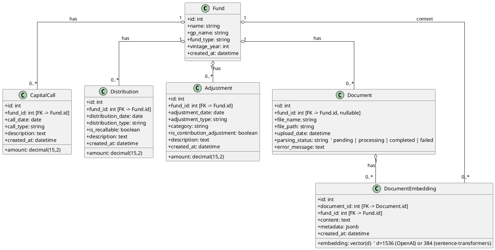

# Data Model and Relationships

This document describes the core data model used by the Fund Performance Analysis System. It covers the entities, their attributes, and the relationships between them. A PlantUML class diagram is included for a visual overview.

- Database: PostgreSQL 15 (with pgvector extension for embeddings)
- ORM: SQLAlchemy (Python)

## Entities (overview)

- Fund: top-level entity representing an investment fund.
- CapitalCall: contribution transactions from LPs into the fund (outflows for LPs).
- Distribution: cash returned to LPs (inflows for LPs), optionally recallable.
- Adjustment: rebalances/adjustments that affect PIC and/or distributions (e.g., recallable distribution, call adjustment).
- Document: uploaded PDF (or other document) tied to a fund; parsed into structured data.
- DocumentEmbedding: vectorized text chunks stored in Postgres (pgvector) for retrieval (created directly via SQL, not an ORM model here).

## PlantUML: Class Diagram (ER-style)



Notes:
- The aggregation (o--) indicates that related records belong to a Fund/Document but are not composition-owned in the strict lifecycle sense; deletions are handled at the application layer.
- Vector dimension (d) depends on the embedding model in use; the service ensures the correct dimension at table creation.

## Attributes by table

### funds
- id: PK (serial)
- name: string(255), required
- gp_name: string(255)
- fund_type: string(100)
- vintage_year: int
- created_at: timestamp (default now)

### capital_calls
- id: PK (serial)
- fund_id: FK -> funds.id
- call_date: date, required
- call_type: string(100)
- amount: decimal(15,2), required
- description: text
- created_at: timestamp (default now)

### distributions
- id: PK (serial)
- fund_id: FK -> funds.id
- distribution_date: date, required
- distribution_type: string(100)
- is_recallable: boolean (default false)
- amount: decimal(15,2), required
- description: text
- created_at: timestamp (default now)

### adjustments
- id: PK (serial)
- fund_id: FK -> funds.id
- adjustment_date: date, required
- adjustment_type: string(100)
- category: string(100)
- is_contribution_adjustment: boolean (default false)
- amount: decimal(15,2), required
- description: text
- created_at: timestamp (default now)

### documents
- id: PK (serial)
- fund_id: FK -> funds.id (nullable, a document can be uploaded before a Fund is created and then linked during processing)
- file_name: string(255), required
- file_path: string(500)
- upload_date: timestamp (default now)
- parsing_status: string (pending | processing | completed | failed)
- error_message: text

### document_embeddings (pgvector)
- id: PK (serial)
- document_id: FK -> documents.id
- fund_id: FK -> funds.id
- content: text (the chunk of text)
- embedding: vector(d) (pgvector type)
- metadata: jsonb (arbitrary key/value like page, section, etc.)
- created_at: timestamp (default now)

## Cardinalities and implications
- A Fund aggregates many transaction rows; calculations (PIC, DPI, IRR) derive from these.
- Distributions marked is_recallable can impact adjustments depending on accounting rules; adjustments model explicit rebalances.
- A Document can result in multiple transactions after parsing.
- DocumentEmbedding rows are retrieval units for RAG.

## Indices and performance
- Implicit indices on primary keys and ivfflat index on (embedding) for similarity search.
- Consider adding indices on transactions by (fund_id, date) to improve IRR cash flow queries.

## Data lifecycle
- Upload → Document row (status=pending)
- Background processing → parse tables → insert CapitalCall/Distribution/Adjustment rows → status=completed (or failed with error_message)
- Later milestones: text chunking → embeddings inserted into document_embeddings

---

This PlantUML syntax is compatible with PlantUML 1.2025.1.

---

## Milestone-based examples

The following examples illustrate how the model is populated across milestones. Values shown below come from the provided sample PDF `files/Sample_Fund_Performance_Report.pdf` processed in Milestone B.

### Milestone A (infrastructure up)
- Database is empty (no rows), but tables exist.
- Healthcheck and /docs are reachable.

### Milestone B (document parsing MVP)

After creating a fund and uploading the sample PDF, the system extracts two tables: Capital Calls and Distributions, and inserts them into SQL. Adjustments can be parsed next (optional iteration), so we include both current and expected values.

- Fund (example):
```json
{
  "id": 2,
  "name": "Demo Fund B",
  "gp_name": "Demo GP",
  "fund_type": "VC",
  "vintage_year": 2023,
  "created_at": "2025-10-26T02:18:38.06679Z"
}
```

- Capital Calls (inserted):
```text
Date        | Call Number | Amount     | Description
------------|-------------|------------|-------------------------
2023-01-15  | Call 1      | 5,000,000  | Initial Capital Call
2023-06-20  | Call 2      | 3,000,000  | Follow-on Investment
2024-03-10  | Call 3      | 2,000,000  | Bridge Round Funding
2024-09-15  | Call 4      | 1,500,000  | Additional Capital
```

- Distributions (inserted):
```text
Date        | Type              | Amount    | Recallable | Description
------------|-------------------|-----------|------------|-------------------------
2023-12-15  | Return of Capital | 1,500,000 | No         | Exit: TechCo Inc
2024-06-20  | Income            |   500,000 | No         | Dividend Payment
2024-09-10  | Return of Capital | 2,000,000 | Yes        | Partial Exit: DataCorp
2024-12-20  | Income            |   300,000 | No         | Year-end Distribution
```

- Adjustments (planned/next iteration):
```text
Date        | Type                     | Amount    | Description
------------|--------------------------|-----------|-------------------------------
2024-01-15  | Recallable Distribution  |  -500,000 | Recalled distribution
2024-03-20  | Capital Call Adjustment  |   100,000 | Management fee adjustment
2024-07-10  | Contribution Adjustment  |   -50,000 | Expense reimbursement
```

### Derived metrics examples

- Current MVP (without adjustments applied):
```json
{
  "fund_id": 2,
  "pic": 11500000.0,
  "total_distributions": 4300000.0,
  "dpi": 0.3739,
  "irr": -61.44,
  "tvpi": null,
  "rvpi": null,
  "nav": null
}
```

- Expected with adjustments (for reference):
```
PIC (Net) = 11,500,000 - 500,000 + 100,000 - 50,000 = 11,050,000
DPI       = 4,300,000 / 11,050,000 ≈ 0.3895
```

### Example SQL inserts (equivalent to parsed results)

```sql
-- Fund (created via API in practice)
INSERT INTO funds (id, name, gp_name, fund_type, vintage_year)
VALUES (2, 'Demo Fund B', 'Demo GP', 'VC', 2023);

-- Capital Calls
INSERT INTO capital_calls (fund_id, call_date, call_type, amount, description) VALUES
(2, '2023-01-15', 'Capital Call', 5000000.00, 'Initial Capital Call'),
(2, '2023-06-20', 'Capital Call', 3000000.00, 'Follow-on Investment'),
(2, '2024-03-10', 'Capital Call', 2000000.00, 'Bridge Round Funding'),
(2, '2024-09-15', 'Capital Call', 1500000.00, 'Additional Capital');

-- Distributions
INSERT INTO distributions (fund_id, distribution_date, distribution_type, is_recallable, amount, description) VALUES
(2, '2023-12-15', 'Return of Capital', FALSE, 1500000.00, 'Exit: TechCo Inc'),
(2, '2024-06-20', 'Income', FALSE,  500000.00, 'Dividend Payment'),
(2, '2024-09-10', 'Return of Capital', TRUE, 2000000.00, 'Partial Exit: DataCorp'),
(2, '2024-12-20', 'Income', FALSE,  300000.00, 'Year-end Distribution');

-- Adjustments (to be inserted in a subsequent iteration)
-- INSERT INTO adjustments (fund_id, adjustment_date, adjustment_type, category, is_contribution_adjustment, amount, description) VALUES
-- (2, '2024-01-15', 'Recallable Distribution', 'Recallable Distribution', FALSE, -500000.00, 'Recalled distribution'),
-- (2, '2024-03-20', 'Capital Call Adjustment', 'Capital Call Adjustment', TRUE, 100000.00, 'Management fee adjustment'),
-- (2, '2024-07-10', 'Contribution Adjustment', 'Contribution Adjustment', TRUE, -50000.00, 'Expense reimbursement');
```

### Example API snapshots

- Create fund
```http
POST /api/funds
{
  "name": "Demo Fund B",
  "gp_name": "Demo GP",
  "fund_type": "VC",
  "vintage_year": 2023
}
```

- Upload document (multipart form)
```http
POST /api/documents/upload (multipart)
  fund_id: 2
  file: files/Sample_Fund_Performance_Report.pdf
```

- Check document status
```http
GET /api/documents/{document_id}/status
```

- Get metrics
```http
GET /api/funds/2/metrics
```
