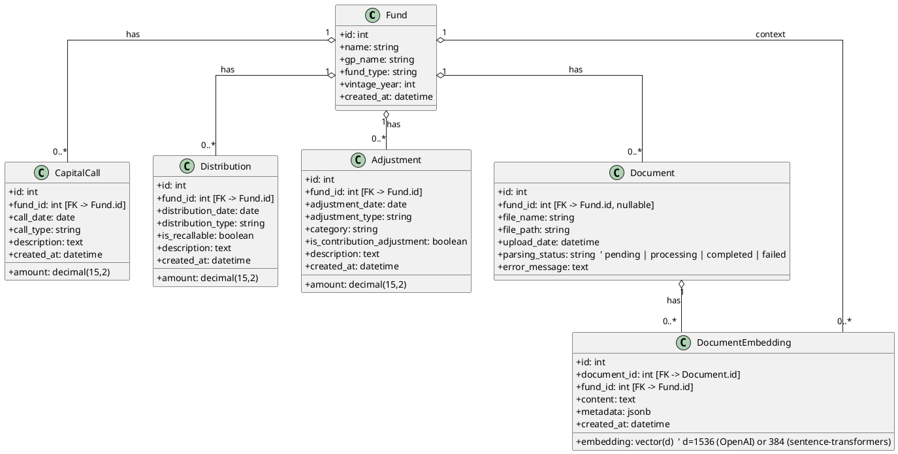

# Data Model and Relationships

This document describes the core data model used by the Fund Performance Analysis System. It covers the entities, their attributes, and the relationships between them. A PlantUML class diagram is included for a visual overview.

- Database: PostgreSQL 15 (with pgvector extension for embeddings)
- ORM: SQLAlchemy (Python)

## Entities (overview)

- Fund: top-level entity representing an investment fund.
- CapitalCall: contribution transactions from LPs into the fund (outflows for LPs).
- Distribution: cash returned to LPs (inflows for LPs), optionally recallable.
- Adjustment: rebalances/adjustments that affect PIC and/or distributions (e.g., recallable distribution, call adjustment).
- Document: uploaded PDF (or other document) tied to a fund; parsed into structured data.
- DocumentEmbedding: vectorized text chunks stored in Postgres (pgvector) for retrieval (created directly via SQL, not an ORM model here).

## PlantUML: Class Diagram (ER-style)

Notes:
- The aggregation (o--) indicates that related records belong to a Fund/Document but are not composition-owned in the strict lifecycle sense; deletions are handled at the application layer.
- Vector dimension (d) depends on the embedding model in use; the service ensures the correct dimension at table creation.

## Attributes by table

### funds
- id: PK (serial)
- name: string(255), required
- gp_name: string(255)
- fund_type: string(100)
- vintage_year: int
- created_at: timestamp (default now)

### capital_calls
- id: PK (serial)
- fund_id: FK -> funds.id
- call_date: date, required
- call_type: string(100)
- amount: decimal(15,2), required
- description: text
- created_at: timestamp (default now)

### distributions
- id: PK (serial)
- fund_id: FK -> funds.id
- distribution_date: date, required
- distribution_type: string(100)
- is_recallable: boolean (default false)
- amount: decimal(15,2), required
- description: text
- created_at: timestamp (default now)

### adjustments
- id: PK (serial)
- fund_id: FK -> funds.id
- adjustment_date: date, required
- adjustment_type: string(100)
- category: string(100)
- is_contribution_adjustment: boolean (default false)
- amount: decimal(15,2), required
- description: text
- created_at: timestamp (default now)

### documents
- id: PK (serial)
- fund_id: FK -> funds.id (nullable, a document can be uploaded before a Fund is created and then linked during processing)
- file_name: string(255), required
- file_path: string(500)
- upload_date: timestamp (default now)
- parsing_status: string (pending | processing | completed | failed)
- error_message: text

### document_embeddings (pgvector)
- id: PK (serial)
- document_id: FK -> documents.id
- fund_id: FK -> funds.id
- content: text (the chunk of text)
- embedding: vector(d) (pgvector type)
- metadata: jsonb (arbitrary key/value like page, section, etc.)
- created_at: timestamp (default now)

## Cardinalities and implications
- A Fund aggregates many transaction rows; calculations (PIC, DPI, IRR) derive from these.
- Distributions marked is_recallable can impact adjustments depending on accounting rules; adjustments model explicit rebalances.
- A Document can result in multiple transactions after parsing.
- DocumentEmbedding rows are retrieval units for RAG.

## Indices and performance
- Implicit indices on primary keys and ivfflat index on (embedding) for similarity search.
- Consider adding indices on transactions by (fund_id, date) to improve IRR cash flow queries.

## Data lifecycle
- Upload → Document row (status=pending)
- Background processing → parse tables → insert CapitalCall/Distribution/Adjustment rows → status=completed (or failed with error_message)
- Later milestones: text chunking → embeddings inserted into document_embeddings

---

This PlantUML syntax is compatible with PlantUML 1.2025.1.
